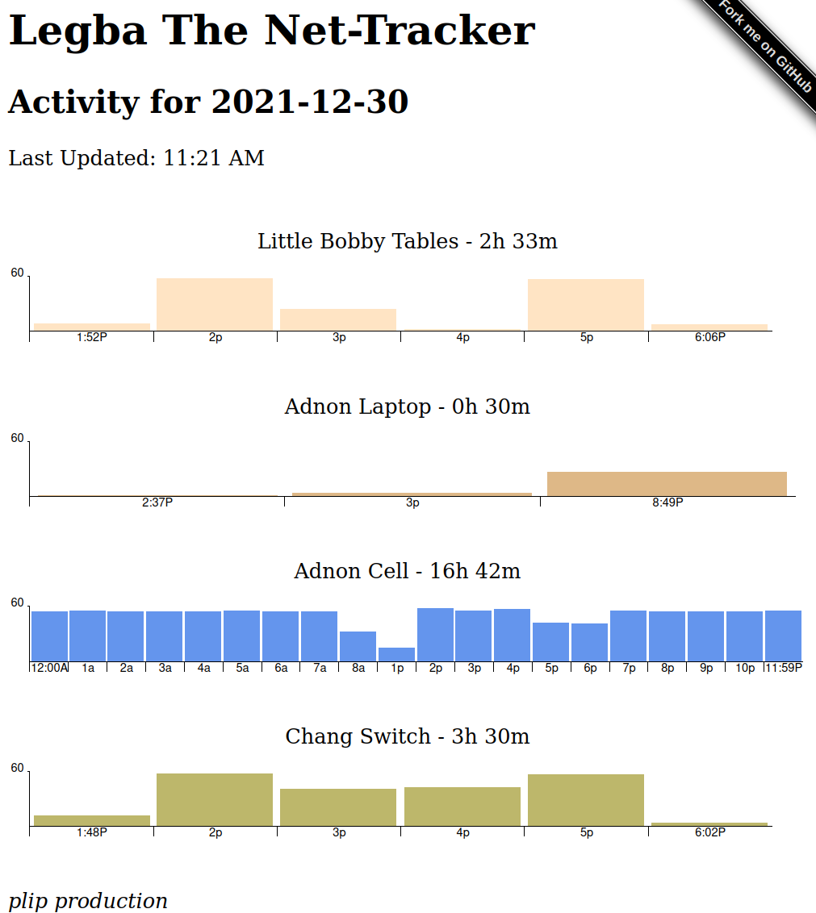

# Legba The Net-Tracker

Track how long devices have been online on your LAN for the current day. Ideal for parents who want to have and open dialog with their kids about how long they should be online on a day-to-day basis. These same parents need to also enjoy setting up random Python projects ;)

The tracking results are shown in an HTML page that automatically reloads the data via AJAX every 60 seconds like this:



Named after [Papa Legba](https://en.wikipedia.org/wiki/Papa_Legba)

If you like the histograms, check out either [Happy Day Histogram (HDH)](https://github.com/mrjones-plip/Happy-Day-Histogram), which Legba uses for a day's activity, or [the original Happy Histogram](https://github.com/Packet-Clearing-House/Happy-Histogram/) to show a year's activity!

## Prerequisites

* python
* web accessible directory to view output - defaults to `/var/www/html/index.html`
* each network device has been statically assigned an IP by your DHCP server.

## Install

1. Create a `legba` user who's home directory is `/home/legba`
2. Clone this repo, `cd` into it so you're in `/home/legba/legba`
3. Copy `conf.dist.py` to `conf.py`
4. Add your devices to `conf.py` in the `trackme` variable.
5. Set your output path in `conf.py` in the `html_file` variable. Ensure the `legba` user can write to this file.
6. Install all the python prerequisites with `pip3 install -r requirements.txt`
7. Copy the systemd file into place, reload systemd, start and enable it:

    ```    
    sudo cp legba.service /etc/systemd/system/
    sudo systemctl daemon-reload
    sudo systemctl enable legba
    sudo systemctl start legba
    ```

In step 4, you can assign more than one IP to a person.  For example if they use a dock with Ethernet which gets a different IP than their WiFi card.

## Troubleshooting

The install steps has you run the service as an unprivileged user `legba`.  Make sure this user exists, owns all the folders and files in `/home/legba` and can write to the `html_file` destination.  For me, I just did a `chown legba /var/www/html`.  

Check the service to see if it has any errors: `sudo systemctl status legba`. You can also watch the `syslog` realtime to further debug: `sudo tail -f /var/log/syslog`

## Todo

- [x] Add github link to output
- [x] Make it a bit more responsive on mobile
- [X] Add first and last time online
- [ ] Maybe AJAX or autorefresh or both?
- [X] Add better running instructions - daemonize this!
